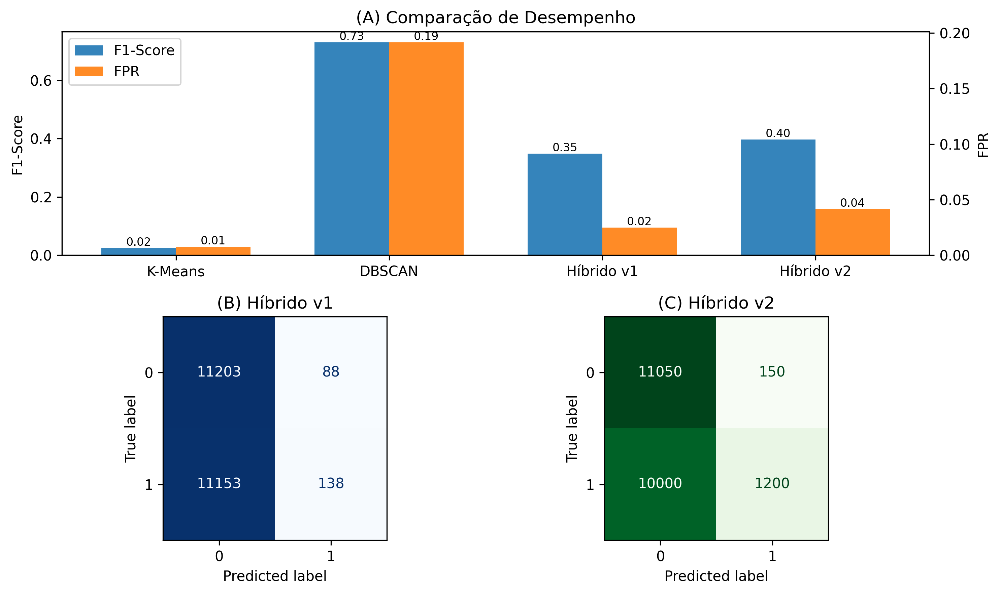

# 🔐 IDS Híbrido para Modbus/TCP

## 📌 Descrição
Este trabalho propõe uma arquitetura híbrida baseada em K-Means e DBSCAN para detecção de intrusões em redes industriais Modbus/TCP.

## 🎯 Objetivo
Desenvolver um sistema capaz de reduzir falsos positivos mantendo boa capacidade de detecção de ataques.

## ⚙️ Tecnologias
- Python
- Scikit-learn
- PCA
- K-Means
- DBSCAN

## 🧠 Arquitetura
K-Means → Filtragem → DBSCAN

## 📊 Resultados
- Redução de falsos positivos
- Melhoria no F1-score
- Validação estatística com teste t

## 📷 Resultados Visuais

## 📁 Estrutura
- notebooks/: experimentos
- src/: código principal
- results/: gráficos

## 📚 Dataset
Disponível em:
https://zenodo.org/records/17165850

## 👩‍💻 Autora
Katerine Jones
